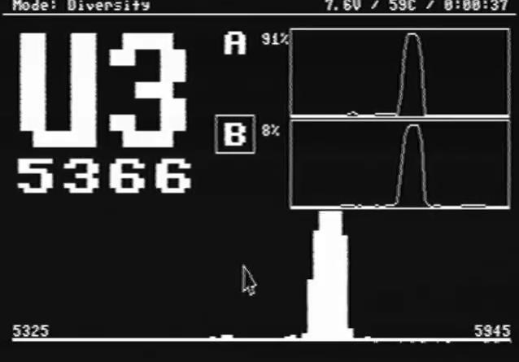

# !!! Still in development !!!

    

# Wiring

  

# Hardware

- **Realacc-RX5808-PRO-PLUS-OSD**
- **Eachine PRO58 RX Diversity** UNTESTED The Realacc hex should work (with and without the resistor mod) since the pinouts are the same. Please report back if you have this module and able to test.

# Contributing
Any contributions are welcome!

Please see the [wiki](https://github.com/JyeSmith/FENIX-rx5808-pro-diversity/wiki/Contributing) on how to setup the development environment.

## Recognition

This code is a forked from [sheaivey/rx5808-pro-diversity](https://github.com/sheaivey/rx5808-pro-diversity) and wouldn't be possible without the awesome work of the following contributors.

- SPI driver based on fs_skyrf_58g-main.c Written by Simon Chambers
- TVOUT by Myles Metzel
- Scanner by Johann Hermen (der-Frickler.net)
- Initial 2 Button version by Peter (pete1990)
- Refactored and GUI reworked by Marko Hoepken
- Universal version my Marko Hoepken
- Diversity Receiver Board and GUI improvements by Shea Ivey
- Adding Race Band by Shea Ivey
- Separating Display concerns for TVOut and OLED by Shea Ivey
- Adding Setup Menu by Shea Ivey
- DIY Throughole board and documentation. by RCDaddy
- Voltage monitoring by kabturek
- v2.0 Firmware Overhaul by @Knifa

# License
## Code
The code is distrubuted under the [MIT license](LICENSE.md).
