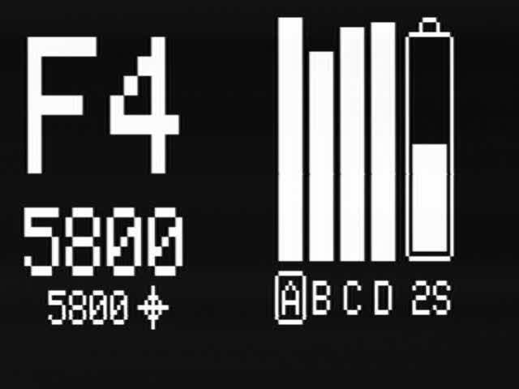
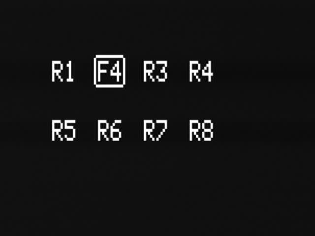
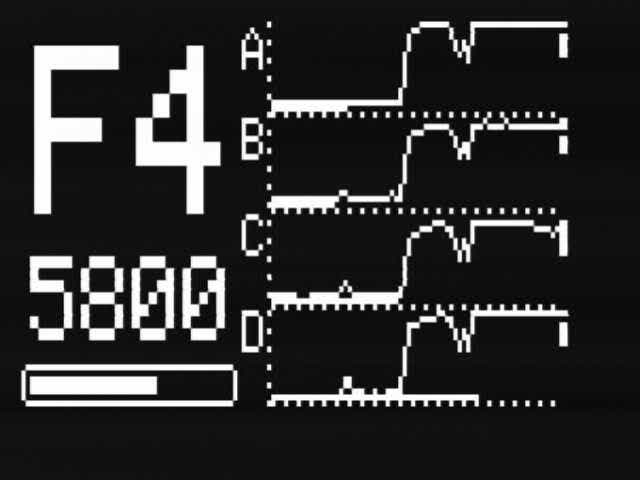
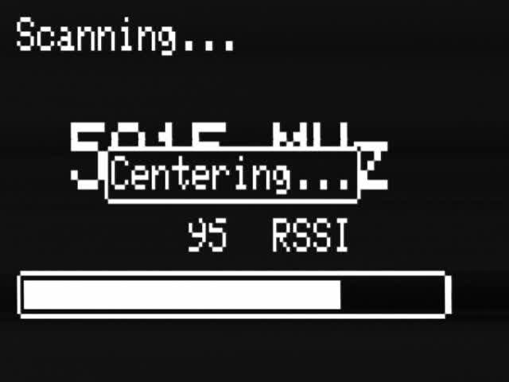
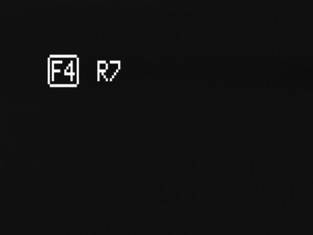
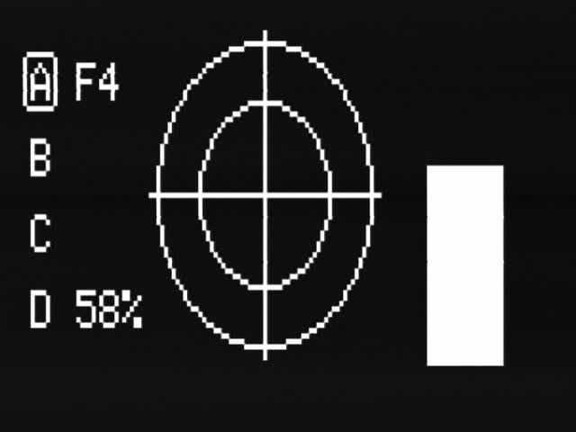
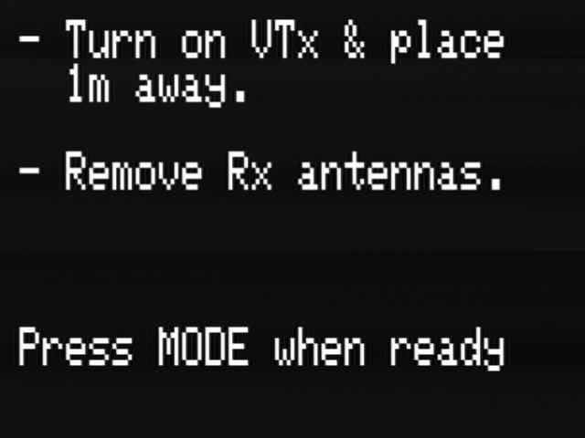
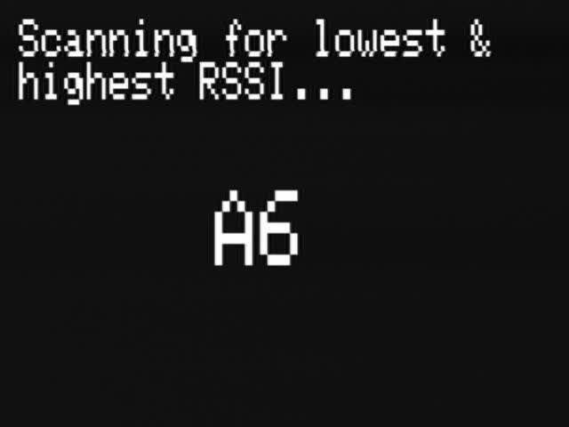
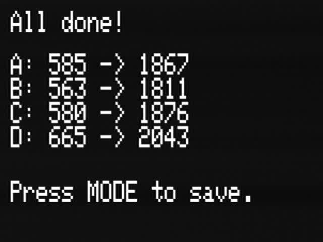

    

# Table of Contents
1. [Releases](#releases)
2. [Features](#features)
3. [Overview](#overview)
4. [Hardware](#hardware)
5. [Firmware](#firmware)
6. [Contributing](#contributing)
7. [License](#license)

# Releases
The latest release can be found here. [Latest Releases](https://github.com/JyeSmith/FENIX-rx5808-pro-diversity/releases)

# Features
- **2 and 4 Antenna Diversity** - Supports Quadversity.
- **In Goggle Menu** - No need to remove your goggles.  Everything shown on the OLED can be shown in your goggles.
- **User Control** - 3 (or 5) Button navigation, mode, up, down (left, right).
- **Home Page** - Set channel manually. 3 Home layouts to select from.
- **Favourites Page** - Setup 8 of your favourite channels.
- **Search Mode** - Search channels based on RSSI.
- **Spectrum** - Print spectrum of all 72 channels.
- **Spectator Mode** - Scans for active channels.
- **Finder Mode** - Visual and audible indication of RSSI.
- **Screen Saver** - Choice of screensaver logo.
- **Settings Menu** - Customise functionality.
- **Adv Settings Menu** - Tweak internal settings while in the field.
- **State Memory** - Boots into state you powered down in.
- **Auto Save** - Saves settings after a second of inactivity.
- **Beeper** - Acoustic feedback on important actions
- **RSSI Graph** - Running history of RSSI readings.
- **LEDs** - Status and active antenna.
- **Race Band & L-Band** - Total of 72 supported channels.
- **OLED Display** - Use a 128x64 OLED.
- **Voltage Monitoring/Alarm**

# Overview

**Quadversity**
- This firmware support 2 and 4 antenna diversity depending on your hardware.

**In Goggle Menu**
- A long (~1s) down press at anytime will display the OLED screen graphics in the goggles.

**Centering Function**
- A single mode press (long mode press while in Home on Realacc module) on most menu pages will start the centering function.  This will quickly sweep the current frequency peak and set the receivers to the center frequency of the peak.  Great to use with a not so perfect VTx or if you are on a close but not correct band/channel e.g. A4 when you should be on F4.  A bullseye will be displayed when centered.

**Home Page**
- Mode - The following depends on your hardware.  Short press will change band or Center.  Long press will Center.
- Up - Change channel.
- Down - Change channel.
- Left - Change band.
- Right - Change band.

3 different Home screen layout can be selected from within the settings page.

  

**Favourites Page**
- Mode - Short press Center.  Long press to highlight slot and change channel.
- Up - Change channel.
- Down - Change channel.

**Search**
- Mode - Short press Center.  Long press opens menu to select auto or manual search, and change search order from frequency to channel order.
- Up - Search up.
- Down - Search down.

**Spectrum**
No interaction.

**Spectator Mode**
- Mode - Short press Center.  Long press to search for active channels.
- Up - Change channel.
- Down - Change channel.

 

**Finder Mode**
- Mode - Change antenna(s) used.

**Calibration**
Follow on screen instructions.  Post calibration you will enter the Home page on the channel with the highest RSSI

  

**Setting**
- Mode - Short press to enter option. Short press again to exit option.
- Up - Change option.
- Down - Change option.

#### Initial Setup
If calibration has not been performed, or the module has been changed between 2 and 4 antenna diversity, the module will boot into the calibration screen.  Once performed the module will boot into the state it was powered down in.

Calibration can be redone again at anytime.

# Hardware

- **Realacc-RX5808-PRO-PLUS-OSD**

# Firmware
The firmware is constantly being improved please refer to the release history for more detailed information on improvements.
[Release History](https://github.com/JyeSmith/FENIX-rx5808-pro-diversity/releases)

# Contributing
Any contributions are welcome!

Please see the [wiki](https://github.com/JyeSmith/FENIX-rx5808-pro-diversity/wiki/Contributing) on how to setup the development environment.

## Recognition

This code is a forked from [sheaivey/rx5808-pro-diversity](https://github.com/sheaivey/rx5808-pro-diversity) and wouldn't be possible without the awesome work of the following contributors.

- SPI driver based on fs_skyrf_58g-main.c Written by Simon Chambers
- TVOUT by Myles Metzel
- Scanner by Johann Hermen (der-Frickler.net)
- Initial 2 Button version by Peter (pete1990)
- Refactored and GUI reworked by Marko Hoepken
- Universal version my Marko Hoepken
- Diversity Receiver Board and GUI improvements by Shea Ivey
- Adding Race Band by Shea Ivey
- Separating Display concerns for TVOut and OLED by Shea Ivey
- Adding Setup Menu by Shea Ivey
- DIY Throughole board and documentation. by RCDaddy
- Voltage monitoring by kabturek
- v2.0 Firmware Overhaul by @Knifa

# License
## Code
The code is distrubuted under the [MIT license](LICENSE.md).
