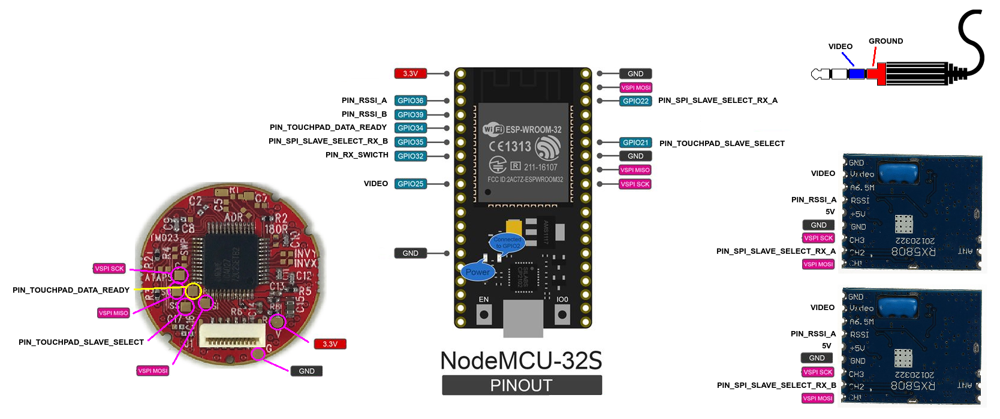

# !!! Still in development !!!

    

# Wiring

# Contributing
Any contributions are welcome!

## Recognition

This code is a forked from [sheaivey/rx5808-pro-diversity](https://github.com/sheaivey/rx5808-pro-diversity) and wouldn't be possible without the awesome work of the following contributors.

- SPI driver based on fs_skyrf_58g-main.c Written by Simon Chambers
- TVOUT by Myles Metzel
- Scanner by Johann Hermen (der-Frickler.net)
- Initial 2 Button version by Peter (pete1990)
- Refactored and GUI reworked by Marko Hoepken
- Universal version my Marko Hoepken
- Diversity Receiver Board and GUI improvements by Shea Ivey
- Adding Race Band by Shea Ivey
- Separating Display concerns for TVOut and OLED by Shea Ivey
- Adding Setup Menu by Shea Ivey
- DIY Throughole board and documentation. by RCDaddy
- Voltage monitoring by kabturek
- v2.0 Firmware Overhaul by @Knifa

# License
## Code
The code is distrubuted under the [MIT license](LICENSE.md).
